# Navigation Workshop


## 1. Introduction

- This workshop consists in working with a ROS simulated robot with some sensors and to test some concepts related to localization, navigation and mapping algorithms, as well as doing a map exploration exercise. 
- We will use Linux [Ubuntu](https://ubuntu.com/) 18.04 LTS and it’s associated [ROS](https://www.ros.org/) Melodic version.
  - Newer versions haven’t been tested. 
- If you are new to Linux/Ubuntu, you may find it helpful to first do a quick tutorial on common command line tools for Linux. For example, [here](http://www.ee.surrey.ac.uk/Teaching/Unix/).
- If you are new to ROS, we encourage you to follow the [ROS Introduction](http://wiki.ros.org/ROS/Introduction), including the reading of its [Concepts](http://wiki.ros.org/ROS/Concepts) and doing its [Tutorials](http://wiki.ros.org/ROS/Tutorials)
- We will use the Gazebo simulator (version 9.0 coming with ROS Melodic). This simulator has some picky CPU/GPU requirements, so it’s better to use a modern computer.
- For any questions or comments, use the workshop channel in the Slack workspace.

## 2. Installation

* [Setup the environment using Docker](https://gitlab.iri.upc.edu/mobile_robotics/summer_school/cnn_workshop/iri_traffic_sign_cnn_workshop_how_to/-/blob/master/docker/docker_image_installation.md)
   * Alternatively you can do a [manual installation](docs/installation.md).

## 3. Robot description

We will use a simulated version of a robot called Ana, which is equipped with: 
- A 4-wheel skid-steering platform, based on the [Pioneer-3AT](https://www.generationrobots.com/en/402397-robot-mobile-pioneer-3-at.html), 
- Encoders on its motors making possible to compute [Odometry](https://en.wikipedia.org/wiki/Odometry) data, 
- An horizontal and centered 3D 360º lidar ([Velodyne Puck VLP16](https://velodynelidar.com/products/puck/)),
- A front-lower depth camera ([Intel RealSense D435](https://www.intelrealsense.com/depth-camera-d435/))
- Top depth camera (Intel RealSense D435) mounted on pan and tilt servos (2 dof)

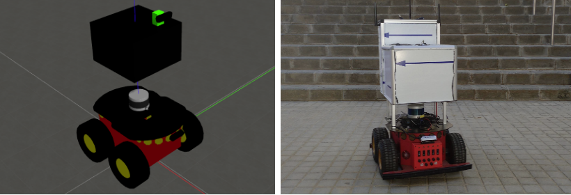


## 4. Launch and tools

To run ROS programs, we use [roslaunch](http://wiki.ros.org/roslaunch), a tool which uses launch XML files, which group up a combination of ROS nodes/processes and allows us to run them all together with a single command. 

To run commands, open Terminal windows with *[Ctrl+Alt+T]* or new tabs with *[Ctrl+Shift+T]* and run the docker as explained in [docker usage](https://gitlab.iri.upc.edu/mobile_robotics/summer_school/cnn_workshop/iri_traffic_sign_cnn_workshop_how_to/-/blob/master/docker/docker_image_installation.md#5-usage)

To launch the simulation, run:

```bash
roslaunch iri_ana_gazebo sim_sample.launch world_name:=brl_text rviz:=true
```

Sometimes, gazebo may not launch and crash with an error like `[gazebo] process has died`. If that's the case, retry by doing [Ctrl+c] and launching it again.

### 4.1 Gazebo simulator

The simulator is running in the background, but it also has this GUI window that will show up:
- Showing the simulation world, in this case the BarcelonaRobotLab area in UPC North Campus, with some textures and the Ana robot on it. 
- This GUI view is equivalent to seeing the real robot in a real environment.
- The simulation will try to go in real time, but depending on the computer power, the actual simulation time will be slower. You can check the current value in the Real time factor field of the Gazebo GUI window lower bar, or by running `gz stats` in a terminal. 
- You can interact with the camera on the main window: left-mouse-click to pan, right-mouse-click to zoom and middle-mouse-button to rotate.

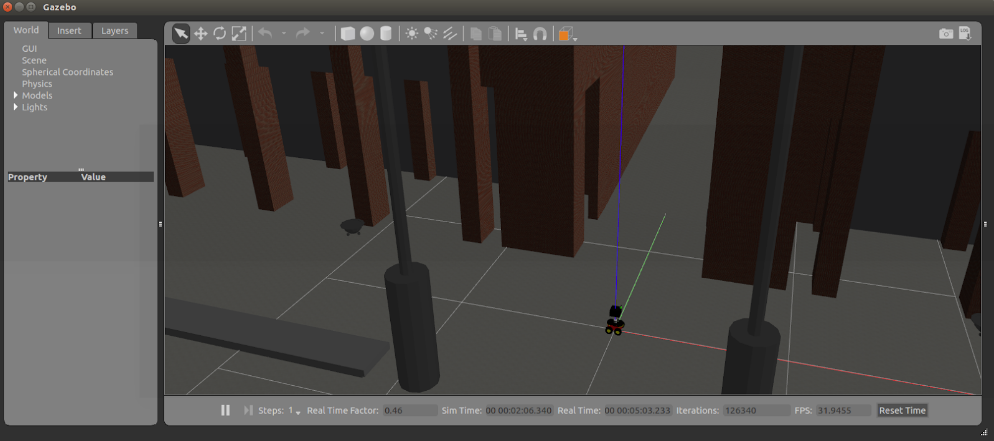

### 4.2 Rviz visualization tool

- [Rviz](http://wiki.ros.org/rviz) allows to plot some 3D information coming from ROS topics, like sensor data, the same way it could be seen with the real robot. 
- The current-loaded Rviz window layout is already configured, but can be manually customized. On the left Display panel, most of the available data types which can be displayed are already added: the robot model, 3D lidar Pointcloud, depth camera Pointcloud and image, etc. You can unfold each Display item to see and change their options.
 
 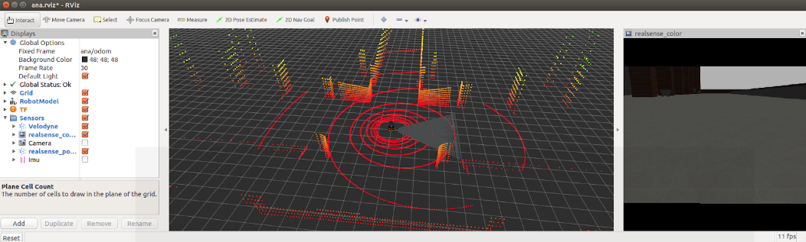

### 4.3 Teleoperation

- To manually move the robot around we will use a node that publishes [Twist](http://docs.ros.org/melodic/api/geometry_msgs/html/msg/Twist.html) messages that reach the `/ana/cmd_vel` topic. 
- To launch the teleoperation node, run:
   ```bash
   roslaunch iri_ana_launch keyboard_teleop.launch
   ```
- Follow the screen instructions to move the robot around by focusing (having clicked) this terminal and using your keyboard.
- You can see the Twist messages sent to the robot by running, in a new Terminal:
   ```bash
   rostopic echo ana/cmd_vel -c 
   ```
### 4.4 TF

In ROS, coordinate-reference systems use [TF](http://wiki.ros.org/tf), which consists of organized trees of frames connected with rotation and translation transforms that may change over time.

On Rviz left panel, GlobalOptions/FixedFrame is set to `ana/odom`. This means Rviz will plot everything from the ana/odom frame perspective. This frame is located on the ground at the start position of the robot, where the odometry data started to be computed.

The rest of the frames (like the base robot frame, `ana/base_footprint`, and the sensor positions) are organized in a tree which hangs from the ana/odom frame.

You can check the current TF tree by running:

```bash
rosrun rqt_tf_tree rqt_tf_tree
```

Also on the Rviz left panel, a TF display is available, where you can inspect the tree and enable/disable the frames to see them in the 3d view (Axis x: red, y: green, z: blue)


### 4.5 Odometry

- Odometry messages use sensor data to create an estimation of the robot position and orientation. 
- You can see the published messages by running in a Terminal:
   ```bash
   rostopic echo ana/odom -c
   ```
- In our case, the real robot odometry is built from encoder wheel/motor information, although in simulation it’s directly generated by the skid-steering Gazebo plugin, not being very realistic.
- As the wheel radius is used to compute the odometry and its value may vary or not be accurate, and also the wheels can slip, especially on a skid-steering drive platform, odometry data keeps accumulating error which would end up introducing a big drift on the robot position. 
- As having an accurate robot position is needed for many robotic tasks, some correction methods are needed, like localization in a map.

## 5. Localization

In ROS, a 2D map set of tools are provided. The [map_server](http://wiki.ros.org/map_server) node allows users to load maps from files and publish them as [OccupancyGrid](http://docs.ros.org/melodic/api/nav_msgs/html/msg/OccupancyGrid.html) messages. These maps can be generated by moving the robot around the environment equipped with a sensor providing 2D data. You will see more about map generation in the Mapping section. For now, a previously generated map will be loaded.

Note that we are talking about 2D data. In our case, the 3D lidar [Pointcloud](http://docs.ros.org/melodic/api/sensor_msgs/html/msg/PointCloud2.html) is transformed to 2D [LaserScan](http://docs.ros.org/melodic/api/sensor_msgs/html/msg/LaserScan.html) messages. 

To clean your running nodes up, you can finish all running processes by doing **[Ctrl+c]** on each terminal (the one running Gazebo may take a while until shutdown), and start over with the following commands:

   ```bash
   roslaunch iri_ana_gazebo sim_sample.launch world_name:=brl_text
   
   roslaunch iri_ana_rosnav nav_map.launch map_name:=brl_text
   
   roslaunch iri_ana_launch keyboard_teleop.launch
   ```

In the Rviz left panel, enable the AMCL folder.

As you can see, now Rviz shows a map display as a ground image with a 2D representation of the Gazebo world. The white cells are the free space, black cells the map obstacles, and grey cells the unknown space. The initial position of the robot in the map has already been correctly set (in fact it is x=0.0m y=0.0m), that’s why the laser data matches the map obstacles, which means, the robot is correctly localized in the map. 

The localization method used is [AMCL](http://wiki.ros.org/amcl), a probabilistic localization system for a robot moving in 2D using a particle filter, which tries to match laser scans to the map thus detecting if there is any drift occurring in the pose estimate based on the odometry. This drift is then compensated by publishing a TF transform between the map frame and the odom frame such that at the end the transform map->robot_frame corresponds to the real pose of the robot in the world.

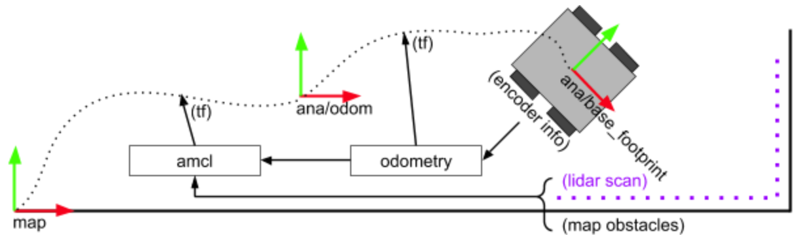

In the previous image we see how the odometry reads from encoder data and publishes the TF transform between `ana/odom` and `ana/base_footprint` frames. Then, AMCL node compares the lidar scans with the map, and extracts the needed correction to improve the robot position, publishing it as a TF transform between the map and ana/odom frames.

We will now introduce localization errors through Rviz.

- First, in the Rviz left panel, be sure to have enabled the “AMCL” folder and disabled the “Sensor” and “Nav” ones. This will show AMCL data for the purpose of this exercise and hide other non important data.

- Now use the “2D Pose Estimate” tool button from the top bar, and then click and drag somewhere nearby the robot:

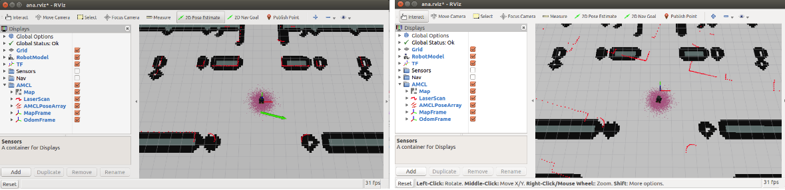

- Now, the robot is not well localized, as the laser scans do not match the map obstacles. 

- Move the robot around using the teleoperation terminal, and see how AMCL keeps correcting the position gradually while its filter particles (small arrows) change and converge. If there are ambiguities and simetries in the map, the localization may not find the correct solution, or find it fast.

## 6. Navigation

ROS provides a 2D navigation framework. See it’s [documentation](http://wiki.ros.org/navigation) for more information and tutorials. The default ROS node used is [move_base](http://wiki.ros.org/move_base), which loads different plugins for local and global costmaps and planning. The following figures show the node inputs and outputs and a general working scheme. 

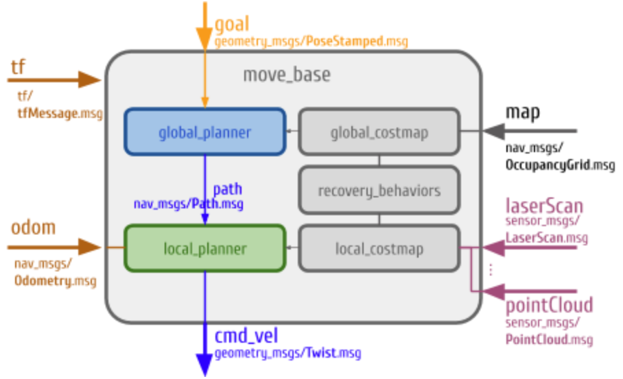

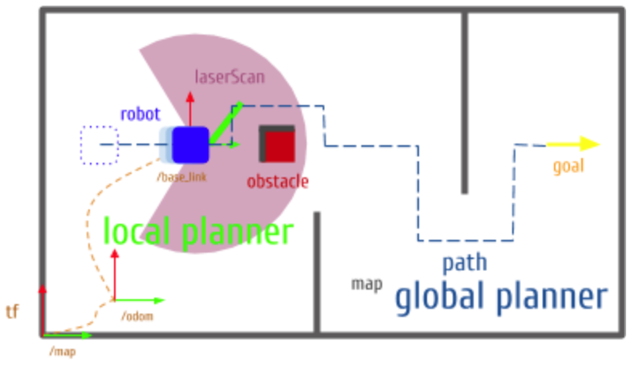

To test this, launch:
   ```bash
   roslaunch iri_ana_gazebo sim_sample.launch world_name:=brl_text
   
   roslaunch iri_ana_rosnav nav_map.launch map_name:=brl_text
   ```

On Rviz, enable the Nav folder on the left panel, and use the top tool “2D Nav Goal” by clicking and dragging somewhere free in the map. 

See how a global plan to the destination is drawn, and the robot starts following it. Also the obstacles taken into account for the local planning (inside the local costmap ±5m) are highlighted in purple/light-blue. 

You can add obstacles in the Gazebo Gui window, and if they come across the navigation path, the robot will replan to avoid them.


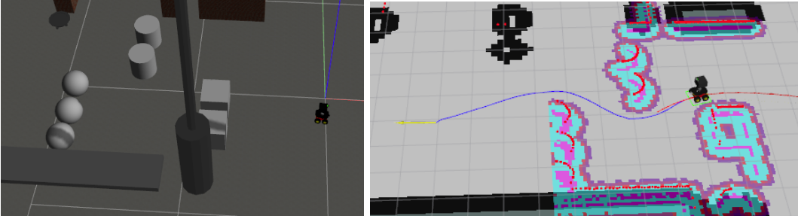

### "3D" navigation

Again, we have been talking about 2D navigation, although move_base can be feeded and configured to receive 3D data from sensors (Pointcloud), they end up being projected into a 2D space and doing a 2D navigation.

As you may have noticed, our Gazebo world is not entirely 2D, it has different levels connected with some ramps. With the normal 2D setup, those ramps are seen as obstacles and the robot wouldn’t be able to plan through them. 

At IRI, we have developed a set of nodes which act as filters of sensor data (3d lidar and depth camera) to be able to take into account 3D environment data, such as holes, up and down staircases, up and down ramps (traversable or not depending on a maximum steep parameter), etc, adding or clearing them up from the costmaps.

You can read more about these filters [here](https://gitlab.iri.upc.edu/mobile_robotics/colrobtransp/3d_navigation/iri_3d_navigation_how_to).

To run this “3D” navigation, launch:

   ```bash
   roslaunch iri_ana_gazebo sim_sample.launch world_name:=brl_text
   
   roslaunch iri_ana_rosnav 3d_nav_map.launch map_name:=brl_text
   ```

Everything should look the same, except for having a few more displays available coming from the filters, and the fact that the robot can now plan through the ramps.

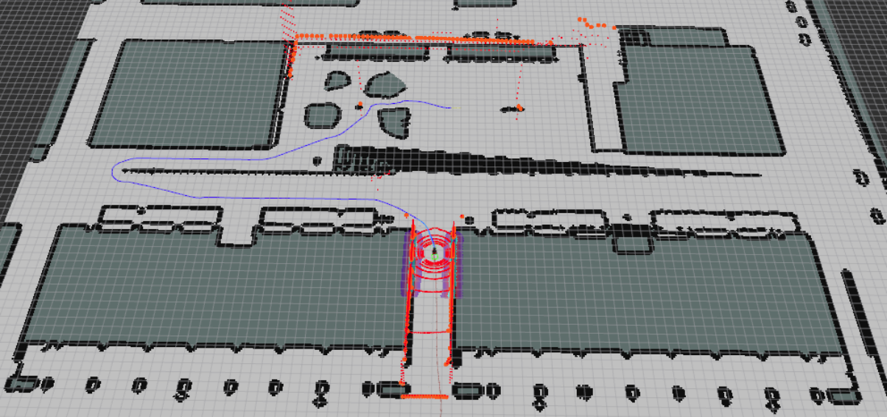

## 7. Mapping

Now we will create a map from the sensor data while being localized in it. A SLAM (Simultaneous Localization And Mapping) algorithm ([gmapping](http://wiki.ros.org/gmapping)) will create a map using LaserScan sensor messages. Launch: 

   ```bash
   roslaunch iri_ana_gazebo sim_sample.launch world_name:=brl_text
   roslaunch iri_ana_rosnav nav_mapping.launch
   ```

In the Rviz left panel, enable the Nav folder.
You can explore the surroundings by sending navigation goals in Rviz as you did earlier, and see how the map updates while you move around. Note that in simulation the laser resolution is reduced, that’s why far obstacles may generate these discontinuous free-unknown space lines until you get closer.

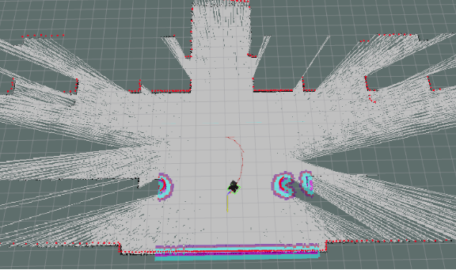

To save the map, open a new Terminal and run:

   ```bash
   roscd iri_maps/maps
   rosrun map_server map_saver -f my_map_name map:=ana/map
   ```

This will create an image `map_name.pgm` and a parameter file `map_name.yaml`, which can be loaded later to navigate through it like you did before:

   ```bash
   roslaunch iri_ana_gazebo sim_sample.launch world_name:=brl_text
   
   roslaunch iri_ana_rosnav nav_map.launch map_name:=my_map_name 
   ```
## 8. Exploration

Instead of having to manually move the robot, an exploration algorithm would decide where the robot should go. You will now run a node which will do this exploration sending random navigation goals to the robot within the map limits. This time we will use a smaller world consisting of some small rooms. 

   ```bash
   roslaunch iri_ana_gazebo sim_sample.launch world_name:=rooms
   ```

   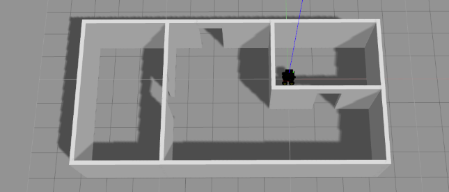

   ```bash
   roslaunch iri_ana_rosnav nav_mapping.launch
   ```

   - Enable Rviz Nav Display folder

   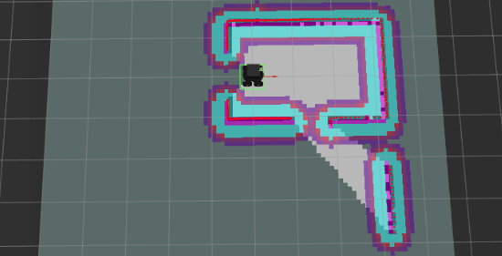

   ```bash
   rosrun iri_exploration exploration
   ```

On the exploration terminal you can read some stats about the last goal sent (x,y,yaw) and exploration status (meters travelled, time elapsed, area explored). 

### 8.1 Exploration concepts

**Goal selection policy: where to go?**

Entails to analyze the current state of the environment (map and robot pose) and decide a goal to guarantee two antagonic situations, coverage and localization certainty. This is known as the exploration-exploitation problem: to reconstruct a good map, a good localization is needed and vice versa.

To look for unexplored regions, you can look at frontiers. Frontiers are defined as the boundaries between known and unknown spaces of the map, in particular, between free cells and unknown cells. Traveling to a frontier, the robot will explore unknown areas.

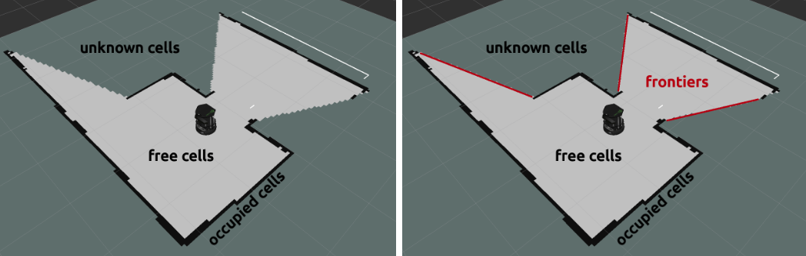

​**Replan policy: when to go?**

Deciding when a new goal should be computed is important to speed up the exploration. It has two main different approaches (that can be combined):
- Event-based replanning: when the goal is reached or almost reached, when the map has changed, or changed significantly (many new free cells and/or obstacles), etc.
- Frequency-based replanning: after a certain time period, certain distance travelled, etc.

### 8.2 Exploration exercise

The goal of this exercise is that you modify the exploration node source code and implement an exploration strategy different from the existing one (where: random goal, when: when previous goal reached), and using the provided frontier data. 

To do so, inspect and modify the source code of the exploration node (replace `edit` with your favourite text editor):

   ```bash
   roscd iri_exploration
   
   edit src/exploration.cpp
   ```

You only need to write your own code between the `//TODO` and `//TODO END` comments:
- **TODO 1**: variables and functions. If you need your own variables and functions define them here.
- **TODO 2**: replan(): choose when to compute and send a new goal to the platform. Check useful given variables: `robot_status_`, `robot_pose_`, `target_goal_`.
- **TODO 3**: decideGoal(): choose where to send the robot given the current map and robot information. Check useful given variables: `frontiers_`, `robot_pose_`.


When coded your solution, remember to compile:

   ```bash
   roscd && cd ..
   
   catkin_make
   ``` 
Then you can test your solution:

   ```bash
   roslaunch iri_ana_gazebo sim_sample.launch world_name:=rooms

   roslaunch iri_ana_rosnav nav_mapping.launch

   rosrun iri_exploration exploration
   ```

If the robot gets stuck (sometimes can happen), you can launch the `keyboard_teleop` like you did before and move the robot a little until it can continue exploring.

​These are some given useful variables:

```cpp
int robot_status_
   The robot status.
   0: moving, 1: goal reached, 2: couldn't reach goal.
   Updated in moveRobot and move_baseDone functions.

geometry_msgs::Pose robot_pose_
   The robot position and orientation in map coordinates. 
   Updated in refreshRobotPosition function.
   Pose is a ROS specific msg type from the geometry_msgs package
      See info here: http://docs.ros.org/api/geometry_msgs/html/msg/Pose.html
      Or doing: rosmsg show geometry_msgs/Pose

nav_msgs::OccupancyGrid map_
   The map received by the mapping process.
   Updated in occupancy_gridCallback function.
   OccupancyGrid is a ROS specific msg type from the nav_msgs package
      See info here: http://docs.ros.org/api/nav_msgs/html/msg/OccupancyGrid.html
      Or doing: rosmsg show nav_msgs/OccupancyGrid

geometry_msgs::Pose target_goal_
   The last goal sent to the robot (in map coordinates).

double wheel_travelled_distance
	Distance in meters travelled by a robot wheel.
	Updated in refreshRobotPosition function.

vector<frontier> frontiers_;
	Vector of frontiers detected in the last received map.
	Updated in findFrontiers function.
   A frontier struct contains:
      int id: frontier identifier
      unsigned int size: frontier size (amount of map cells).
      int center_cell: central cell
      int free_center_cell: free cell closest to central cell
      geometry_msgs::Point center_point: central cell position  (in map coordinates)
      geometry_msgs::Point free_center_point: free cell position  (in map coordinates)
      vector<int> frontier_cells: vector of the frontier cells
      vector<geometry_msgs::Point> frontier_points: vector of points  (in map coordinates).
   See the next image for a frontier example.
```

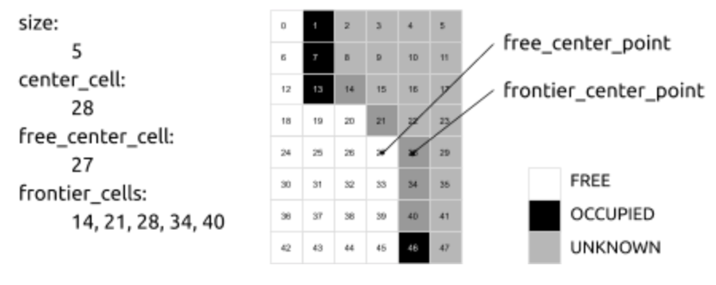


<br />
<br />

An example solution is available in the `example` branch. 

- replan: it doesn't wait for the robot to exactly arrive to the goal but allows replaning once the robot is at 1m from the goal. 
- decideGoal: it goes to the frontier with highest `size + 1/distance` score.

Before executing the next commands, take into account that all changes to the code will be discarded, so save them somewhere if you want to keep them.

```bash
roscd iri_exploration
git checkout -f example
```

Check the code and take a look at the proposed simple solution. Feel free to test it and improve it.

**THE END**
